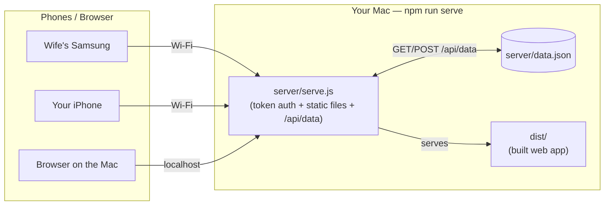
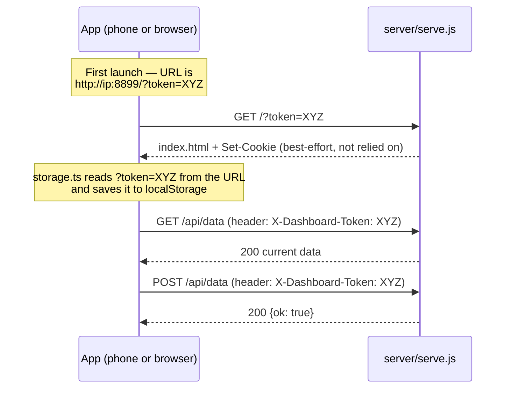
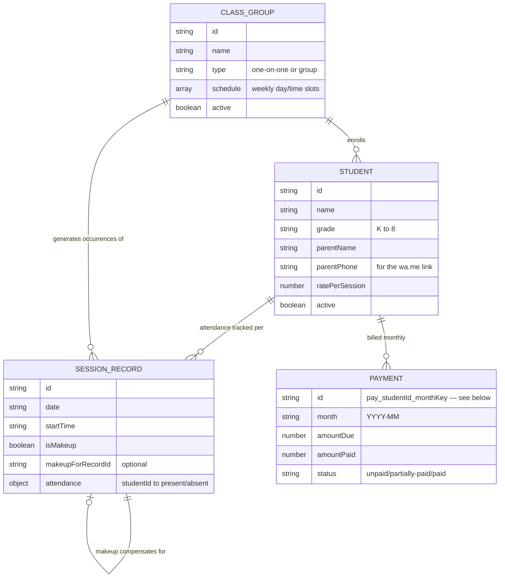

# Design

How the pieces of Tutoring Tracker fit together. See [README.md](./README.md)
for how to actually run it.

## Architecture

The app is a single Expo (React Native + web) codebase. How it's run
determines where the data lives:

All three devices talk to the **same** `server/serve.js` process, which
reads/writes one file, `server/data.json` — that's the entire "database."
There's no separate backend or cloud service. This is what makes the
students/classes/billing consistent across your wife's phone, your phone,
and the Mac's browser, as long as they're all on the same Wi-Fi and the
server's running.

**Dev mode is different.** Running via `npm start` (Expo Go) or `npm run
web` doesn't start `server/serve.js` at all — there's no `/api/data` to
talk to. In that case the app falls back to on-device storage (AsyncStorage
on phones, `localStorage` on web), so each device has its own separate
copy. That's fine for trying out a code change, but it's why day-to-day use
should go through `npm run serve`, not dev mode — see
[storage.ts's fallback logic](./src/data/storage.ts).

## Access token

Every request to `server/serve.js` (other than `manifest.json` and the app
icons, which have to stay public so the OS can fetch them while installing)
requires a token, generated once and saved to `server/access-token.txt`.
This exists so that anything else on the Wi-Fi network can't read your
students' info or billing just by guessing the server's address.

The tricky part: an "Add to Home Screen" app on iOS runs in its **own,
isolated storage container**, separate from Safari itself — cookies and
`localStorage` set while browsing normally don't reliably carry over into
it. (This bit us for real: the app used to rely on a cookie for both the
access token *and* for the data itself, and both silently stopped working
once installed as an icon.) The fix was to stop depending on cookies for
anything that matters:

The token travels as an explicit `X-Dashboard-Token` header on every
`/api/data` call, sourced from a value the client captured and stored
itself — not from the cookie jar. The cookie is still set as a
belt-and-suspenders extra, but nothing depends on it working.

One more consequence of the isolated-container problem: a phone could keep
launching an old, already-cached copy of the app forever, never seeing a
fix like this one. `serve.js` sends `Cache-Control: no-cache` on
`index.html` and `manifest.json` (so the shell always revalidates) and long
cache lifetimes only on the hashed, content-addressed JS/CSS bundle files
(safe, since any code change gives them a new filename anyway).

## Data model

All four types are plain JSON, defined in
[`src/data/types.ts`](./src/data/types.ts) — there's no ORM or schema
migration system; `server/data.json` is just `{ students, groups, sessions,
payments }` serialized directly.

### Session occurrences: virtual until touched

`ClassGroup.schedule` describes a *recurring* weekly slot (e.g. "Tuesdays,
4pm, 60 min"). The app does **not** pre-generate a `SessionRecord` for
every future Tuesday — that would mean an ever-growing, mostly-empty table.
Instead, [`getOccurrencesForDate`](./src/data/store.tsx) computes a
"virtual" occurrence on the fly for any date that matches a group's weekly
schedule. The first time attendance is actually marked for that date, it
becomes a real, persisted `SessionRecord` (same deterministic id:
`<groupId>_<date>_<startTime>`, so it's the same occurrence whether you
look at it before or after it's saved).

A missed session can spawn a **makeup**: a one-off `SessionRecord` with
`groupId: null`, `isMakeup: true`, and `makeupForRecordId` pointing back at
the session that was missed. It's billed exactly like any other session —
billing doesn't distinguish makeups from regular attendance, it just counts
every `SessionRecord` in the month where that student's attendance is
`"present"`.

### Billing: why the Payment id is deterministic

`getMonthlyBilling(monthKey)` computes each active student's sessions
attended × rate for that month, and creates a `Payment` row for one if it
doesn't exist yet. That computation reruns constantly (any time the
Billing screen renders). The `Payment.id` for a not-yet-saved row is
`pay_<studentId>_<monthKey>` — deliberately **not** a random id.

This mattered in practice: an earlier version minted a random id per
computation, so two separate calls to `getMonthlyBilling` for the same
student/month produced two *different* ids. The Billing screen would
render a row with one id, and tapping "Mark Paid" would look it up by
recomputing billing internally — getting a different, non-matching id —
so the save silently did nothing. Making the id a deterministic function of
`(studentId, monthKey)` means every computation agrees on what a given
month's payment for a given student is called, whether or not it's been
saved yet.

## WhatsApp reminders

There's no WhatsApp API integration — `src/data/whatsapp.ts` builds a
plain [`wa.me`](https://faq.whatsapp.com/425247423114725) link with the
message pre-filled (`https://wa.me/<phone>?text=<message>`) and opens it.
The parent's phone must be a valid WhatsApp number; nothing is sent
automatically, so there's no account, approval process, or per-message
cost involved — the person using the app still taps Send themselves.
