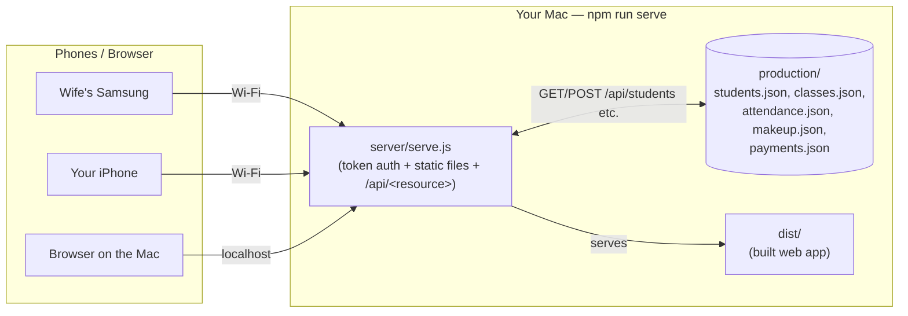
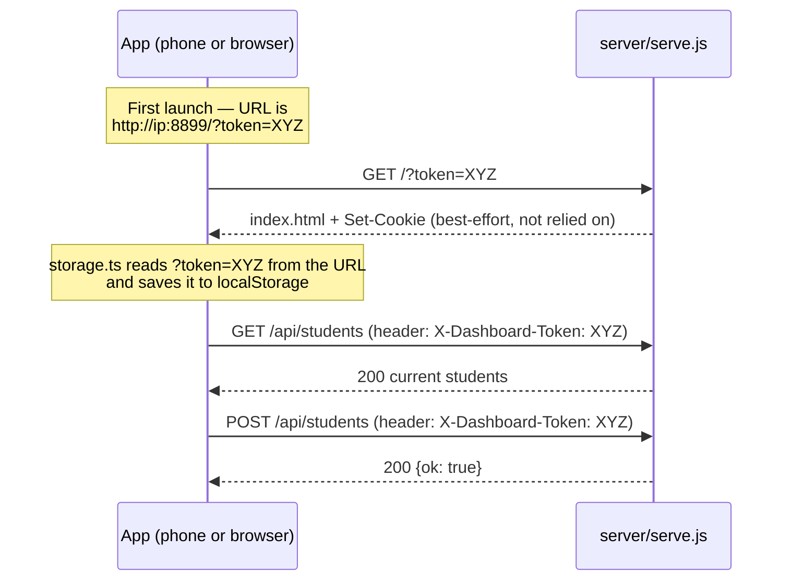
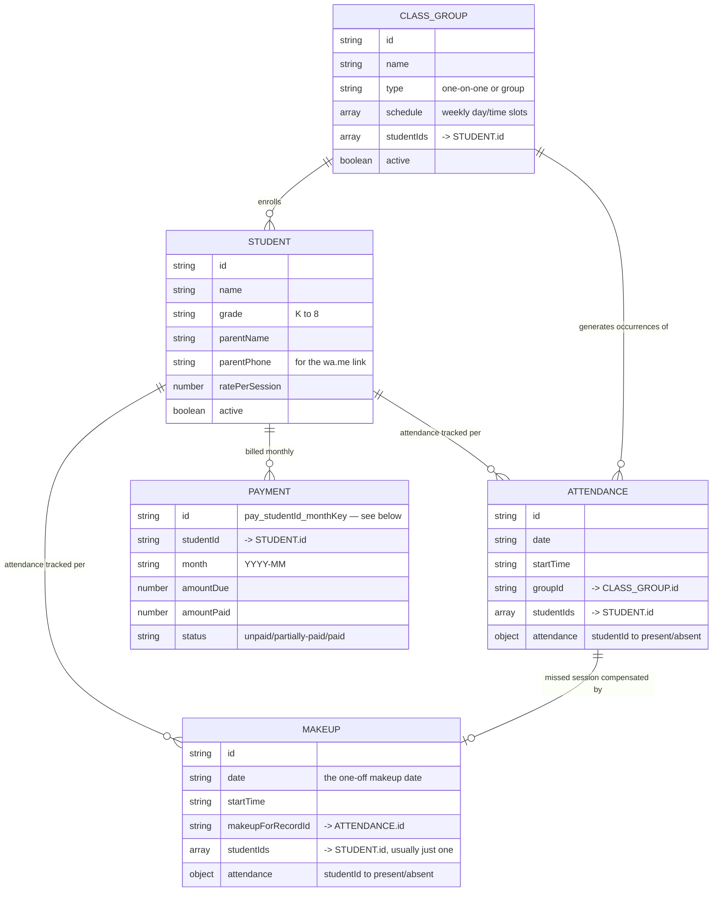

# Design

How the pieces of Tutoring Tracker fit together. See [README.md](./README.md)
for how to actually run it.

## Architecture

The app is a single Expo (React Native + web) codebase. How it's run
determines where the data lives:



All three devices talk to the **same** `server/serve.js` process, which
reads/writes the files in `production/` — that's the entire "database,"
one plain JSON array per entity, nowhere else. There's no separate backend
or cloud service. This is what makes the students/classes/billing
consistent across your wife's phone, your phone, and the Mac's browser, as
long as they're all on the same Wi-Fi and the server's running.

`production/` is not to be touched for anything but real use — no testing,
no seeding fixtures, nothing (see [Automatic backups](#data-model) below
for why this is a hard rule now, not just a good idea). To test something
against a scratch data set instead, point the server at a different folder:

```
TUTORING_DATA_DIR=/tmp/some-test-folder node server/serve.js
```

**Dev mode is different.** Running via `npm start` (Expo Go) or `npm run
web` doesn't start `server/serve.js` at all — there's no `/api/data` to
talk to. In that case the app falls back to on-device storage (AsyncStorage
on phones, `localStorage` on web), so each device has its own separate
copy. That's fine for trying out a code change, but it's why day-to-day use
should go through `npm run serve`, not dev mode — see
[storage.ts's fallback logic](./src/data/storage.ts).

## Access token

Every request to `server/serve.js` (other than `manifest.json` and the app
icons, which have to stay public so the OS can fetch them while installing)
requires a token, generated once and saved to `server/access-token.txt`.
This exists so that anything else on the Wi-Fi network can't read your
students' info or billing just by guessing the server's address.

The tricky part: an "Add to Home Screen" app on iOS runs in its **own,
isolated storage container**, separate from Safari itself — cookies and
`localStorage` set while browsing normally don't reliably carry over into
it. (This bit us for real: the app used to rely on a cookie for both the
access token *and* for the data itself, and both silently stopped working
once installed as an icon.) The fix was to stop depending on cookies for
anything that matters:



The token travels as an explicit `X-Dashboard-Token` header on every
`/api/<resource>` call, sourced from a value the client captured and stored
itself — not from the cookie jar. The cookie is still set as a
belt-and-suspenders extra, but nothing depends on it working.

One more consequence of the isolated-container problem: a phone could keep
launching an old, already-cached copy of the app forever, never seeing a
fix like this one. `serve.js` sends `Cache-Control: no-cache` on
`index.html` and `manifest.json` (so the shell always revalidates) and long
cache lifetimes only on the hashed, content-addressed JS/CSS bundle files
(safe, since any code change gives them a new filename anyway).

## Data model

Five files in `production/`, each a plain JSON array, related to each
other by id fields rather than by nesting:



`production/students.json`, `classes.json`, `attendance.json`,
`makeup.json`, and `payments.json` are each exactly one of the arrays
above, and that's the entire "schema" — no ORM, no migrations. In memory
(`src/data/store.tsx`), attendance + makeup are combined into one
`sessions` list for convenience (the calendar/billing logic doesn't care
which file a record came from, only its `isMakeup` flag, which still
exists on the shared `SessionRecord` type in
[`src/data/types.ts`](./src/data/types.ts)) — persisting always splits
them back apart by that same flag before writing.

**Automatic backups.** Every write to any of these files snapshots the
*entire* `production/` folder as it stood immediately before, into
`production/backups/<timestamp>/` (best-effort, never blocks the actual
save; the oldest snapshots beyond the most recent ~200 get pruned). This
exists because real user data was lost once — testing directly against the
live data file, then deleting it during cleanup — and needed to be
recovered from a browser's local storage. **`production/` is never to be
used for testing, ever** — point `server/serve.js` at a different folder
via the `TUTORING_DATA_DIR` environment variable for anything experimental
instead.

**Off-machine backups.** `production/backups/` above is same-machine only
— it protects against a bad write, not against this Mac itself failing.
`server/backup.sh` (`npm run backup`) is the separate, off-machine answer:
tars up the five current data files (not the on-disk `backups/` history —
that's the same-machine net, this is the off-machine one), encrypts it with
`openssl enc -aes-256-cbc -pbkdf2` using a passphrase typed interactively
(never stored anywhere — openssl's own prompt, hidden input, typed twice),
and writes the result to `~/Documents/TutoringTrackerBackups/`.

Getting it into Google Drive is a real API upload, not just a synced
folder: `server/gdrive-auth.js` (`npm run gdrive-auth`, one-time) runs a
standard OAuth "installed app" flow — a tiny loopback HTTP server on
`127.0.0.1:53682` as the redirect target, the user approves access in
their own browser, and the resulting refresh token is saved to
`server/gdrive-credentials.json` (gitignored — it grants real upload
access). It deliberately requests the narrowest scope,
`drive.file` — this app can only ever see/manage files it creates itself,
never browse or read the rest of the user's Drive. `server/gdrive-upload.js`
then uses that refresh token to mint a fresh access token per upload (they
expire quickly; refresh tokens don't) and does a `multipart/related`
POST to the Drive v3 upload endpoint with `parents: [FOLDER_ID]` set to
the user's chosen folder (hardcoded — this is single-user, single-folder
by design, not a general integration).

`backup.sh` calls `gdrive-upload.js` automatically after every backup, but
never depends on it: if credentials don't exist yet (`gdrive-auth` not run
yet) or the upload fails for any reason, it falls back to `open`-ing the
file's Finder location and the Drive folder in the browser so the user can
drag it over manually — a failed/unset-up upload must never block a
backup from being made. `server/restore.sh` (`npm run restore -- <file>`)
reverses it — decrypts, then safety-copies
the current `production/` to `production-before-restore-<timestamp>/`
(gitignored) before replacing it, so a restore itself can never destroy
data either.

### Session occurrences: virtual until touched

`ClassGroup.schedule` describes a *recurring* weekly slot (e.g. "Tuesdays,
4pm, 60 min"). The app does **not** pre-generate a `SessionRecord` for
every future Tuesday — that would mean an ever-growing, mostly-empty table.
Instead, [`getOccurrencesForDate`](./src/data/store.tsx) computes a
"virtual" occurrence on the fly for any date that matches a group's weekly
schedule. The first time attendance is actually marked for that date, it
becomes a real, persisted `SessionRecord` (same deterministic id:
`<groupId>_<date>_<startTime>`, so it's the same occurrence whether you
look at it before or after it's saved).

A missed session can spawn a **makeup**: a one-off `SessionRecord` with
`isMakeup: true` and `makeupForRecordId` pointing back at the session that
was missed, built by [`MakeupForm`](./src/components/makeup-form.tsx) one
of two ways:
- **Join an existing class's slot** — pick one of the other recurring
  classes and (if it meets more than once a week) which weekly time; the
  form computes the soonest matching date on/after the day after the
  missed session (`nextOccurrenceOnOrAfter` in
  [`src/data/date.ts`](./src/data/date.ts)), with a "use the week after
  instead" button to push it out further. This sets `groupId` to that
  *other* class's id — purely for display (so the occurrence card reads
  e.g. "Tuesday Group (makeup)" and shows up alongside that class's own
  card on that date) — it does **not** add the student to that class's
  roster or affect its own attendance record.
- **Custom date/time** — `groupId: null`, a freely typed one-off time, for
  anything that doesn't match an existing slot.

Either way it's billed exactly like any other session — billing doesn't
distinguish makeups from regular attendance, it just counts every
`SessionRecord` in the month where that student's attendance is
`"present"`.

### Billing: why the Payment id is deterministic

`getMonthlyBilling(monthKey)` computes each active student's sessions
attended × rate for that month, and creates a `Payment` row for one if it
doesn't exist yet. That computation reruns constantly (any time the
Billing screen renders). The `Payment.id` for a not-yet-saved row is
`pay_<studentId>_<monthKey>` — deliberately **not** a random id.

This mattered in practice: an earlier version minted a random id per
computation, so two separate calls to `getMonthlyBilling` for the same
student/month produced two *different* ids. The Billing screen would
render a row with one id, and tapping "Mark Paid" would look it up by
recomputing billing internally — getting a different, non-matching id —
so the save silently did nothing. Making the id a deterministic function of
`(studentId, monthKey)` means every computation agrees on what a given
month's payment for a given student is called, whether or not it's been
saved yet.

## WhatsApp reminders

There's no WhatsApp API integration — `src/data/whatsapp.ts` builds a
plain [`wa.me`](https://faq.whatsapp.com/425247423114725) link with the
message pre-filled (`https://wa.me/<phone>?text=<message>`) and opens it.
The parent's phone must be a valid WhatsApp number; nothing is sent
automatically, so there's no account, approval process, or per-message
cost involved — the person using the app still taps Send themselves.

## Testing

`npm test` (see [README.md](./README.md#running-the-tests)) runs two Jest
projects, configured in `package.json`'s `"jest"` field:

- **`app`** (`src/data/__tests__/`, `jest-expo` preset) — the business
  logic: date math, WhatsApp message builders, and the biggest one,
  `store.test.tsx`, which exercises the real `AppDataProvider`/`useAppData`
  hook end-to-end via `@testing-library/react-native`'s `renderHook`
  (`src/data/storage.ts` is mocked with an in-memory stand-in — reset
  between every test — so nothing touches the network or the filesystem).
  This is where the trickiest logic lives: virtual-vs-persisted session
  occurrences, makeup linking + `needsMakeup`, monthly billing math, and a
  standing regression test that the not-yet-saved Payment id stays
  deterministic across repeated calls (see "why the Payment id is
  deterministic" above — this is the exact bug that test would have caught).
- **`server`** (`server/__tests__/`, plain Node) — spawns the real
  `server/serve.js` as a subprocess against a throwaway `TUTORING_DATA_DIR`
  and a random port, then drives it over real HTTP: token auth (header,
  query param, cookie, wrong token), every `/api/<resource>` endpoint
  (empty-start, shape validation, round-tripping, cross-resource
  isolation), the automatic-backup-before-write behavior, and the
  cache-control headers on `index.html` vs. hashed assets vs. the API.
  Every test file that touches data uses `TUTORING_DATA_DIR` (or the
  mocked storage module, for the `app` project) — **never** `production/`.
  This is a direct response to the incident where real data got
  overwritten by hand-testing against the live file: nothing here can ever
  touch real user data, by construction, not by discipline.

What's *not* covered: the screens themselves (`src/app/**`) aren't
rendered/tested directly — the business logic they call is covered via
`store.test.tsx` instead, which catches the same class of bug (the
Payment-id regression above was a logic bug, not a rendering one) with far
less setup than full screen tests would need. Add screen-level tests if a
future bug turns out to be in the rendering/wiring layer specifically
rather than the logic underneath it.
